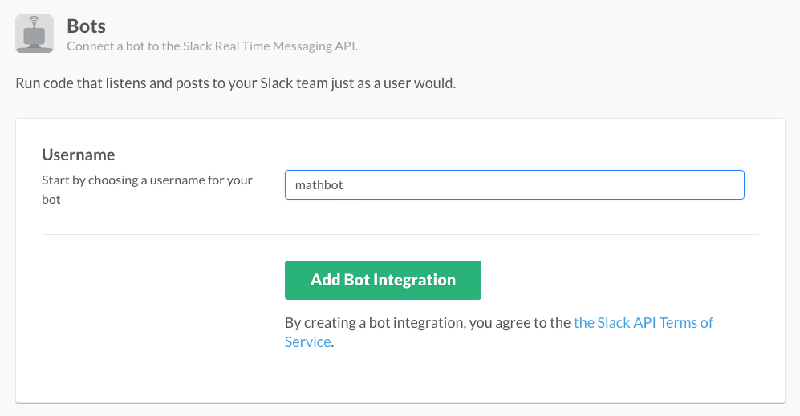

# Ernest-versioner 

_master: [](https://circleci.com/gh/ernestio/ernest-versioner/tree/master) | develop: [](https://circleci.com/gh/ernestio/ernest-versioner/tree/develop)_

This software intends to be an automation on the ernest release process. 
It will follow the next steps in order to completely release ernest.

- [x] For each repo will verify if develop and master branches have diverged
- [x] For each repo will merge develop on master and create a release tag
- [x] Creates a github release on ernest-cli
- [x] Uploads to docker-hub every single service
- [x] Generates vagrant package and uploads it to atlas

## Installation

```
make deps && make install
```

## Using versioner CLI

Before running the script you need to be sure all the repos you want to version are listed on ernest-repositories-list.txt file.
Once you're sure these repos are correct, you only need to run the script as follows:

```
$ ruby versioner.rb version NUMBER FILE
```

Where:

- *NUMBER* : is the version number
- *FILE* : a file with the list of the repos to release

So a real example could look like this:

```
$ ruby versioner.rb version 0.0.1 ernest-repositories-list.txt
```

Additionally in case you want to skip some of the inline questions you can define the following environment variables:

- *GITHUB_TOKEN* : In order to merge develop in master, push, create tags...
- *CI_TOKEN* : In order to check the build status of each repository.
- *SLACK_WEBHOOK_URL* : In case you want slack to be notifying each release step
- *ATLAS_TOKEN* : In order to upload packaged vagrant boxes

So the command will look like:

```
$ GITHUB_TOKEN=my_token SLACK_WEBHOOK_URL=url ATLAS_TOKEN=token ruby versioner.rb version 0.0.1 ernest-repositories-list.txt
```

## Using versioner Slack

### Create a Bot User

In Slack administration create a new Bot Integration under [services/new/bot](http://slack.com/services/new/bot).



On the next screen, note the API token.

#### .env

Create a `.env` file with the API token from above and make sure to add it to `.gitignore`.

```
SLACK_API_TOKEN=...
```

### Procfile

Create a `Procfile` which `foreman` will use when you run the `foreman start` command below.

```
web: bundle exec puma -p $PORT
```

### Run the Bot

Run `foreman start`. Your bot should be running.

```
14:32:32 web.1  | Puma starting in single mode...
14:32:32 web.1  | * Version 2.11.3 (ruby 2.1.6-p336), codename: Intrepid Squirrel
14:32:32 web.1  | * Min threads: 0, max threads: 16
14:32:32 web.1  | * Environment: development
14:32:35 web.1  | * Listening on tcp://0.0.0.0:5000
14:32:35 web.1  | Use Ctrl-C to stop
14:32:36 web.1  | I, [2015-07-10T14:32:36.216663 #98948]  INFO -- : Welcome 'mathbot' to the 'xyz' team at https://xyz.slack.com/.
14:32:36 web.1  | I, [2015-07-10T14:32:36.766955 #98948]  INFO -- : Successfully connected to https://xyz.slack.com/.
```


## Contributing

Please read through our
[contributing guidelines](CONTRIBUTING.md).
Included are directions for opening issues, coding standards, and notes on
development.

Moreover, if your pull request contains patches or features, you must include
relevant unit tests.

## Versioning

For transparency into our release cycle and in striving to maintain backward
compatibility, this project is maintained under [the Semantic Versioning guidelines](http://semver.org/).

## Copyright and License

Code and documentation copyright since 2015 r3labs.io authors.
Code released under
[the Mozilla Public License Version 2.0](LICENSE).
